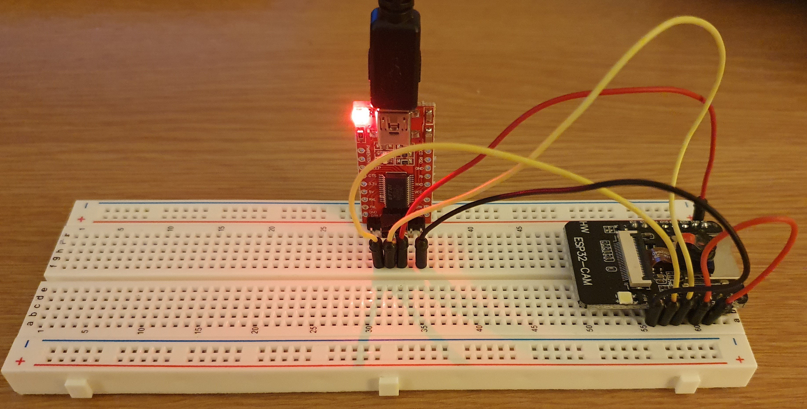
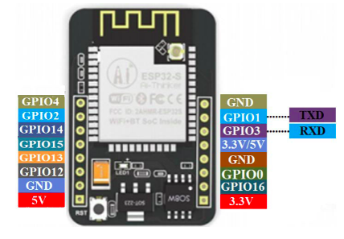
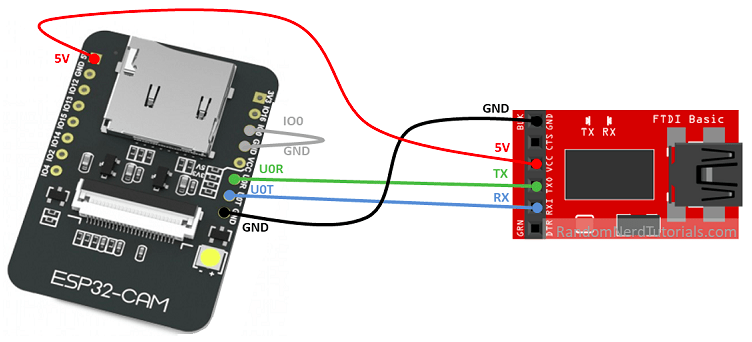
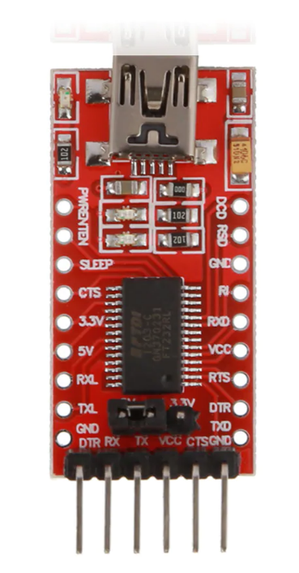
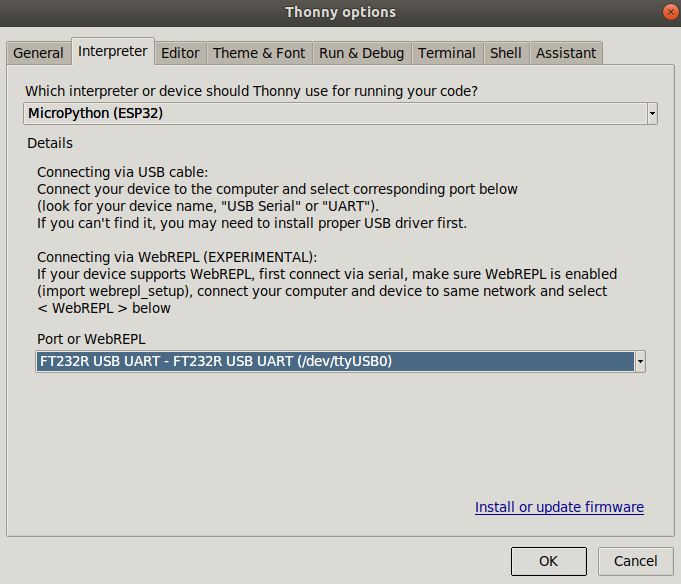
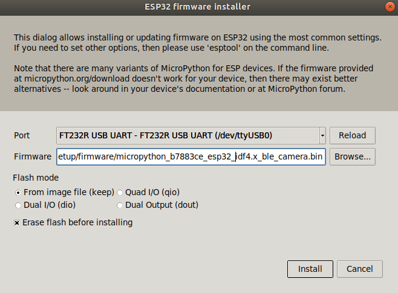
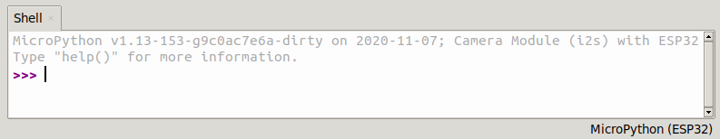

# ESP32CAM MicroPython setup  

**Instructions for flashing MicroPython on the ESP32CAM**  
The current instructions support Linux users only, later revisions will include Windows and macOS 

  

## Hardware used
* ESP32CAM
* FT232RL
* USB to Mini-b cable
* Breadboard
* Male to male breadboard connectors

## Project setup  

### Project dependencies  
For the instructions to work you will need the following programs installed:  
* [Python3](https://www.python.org/downloads/)
* GIT (To install git use `sudo apt-get install git`)

### Python libraries  
Libraries used to interface with the ESP32CAM include:
* esptool (Command line interface to connect and flash the microcontroller)
* rshell (Command line interface to enable repl access and file transfer)
* thonny (Graphical IDE for flashing, loading files and repl access to the microcontroller)  

All libraries and dependancies will be installed after following the setup instructions

### Setup instructions 

To use this project to setup your ESP32CAM with MicroPython, first clone the repository using git. 

```bash
git clone git@github.com:vwhack/esp32cam_setup.git
```  

Navigate into the esp32cam_setup folder  
```bash
cd esp32cam_setup
```  

Create a Python3 virtual environment  
```bash
python3 -m venv myvenv
```

Activate the virtual environment  
```bash
source myvenv\bin\activate
```

Install Python libraries  
```bash
pip install -r requirements.txt
```

## Connecting the FT232RL to the ESP32CAM  
Before you can flash and communicate with the microcontroller, you will need USB serial access. This is done by connecting the FT232RL (USB to serial interface) with the ESP32CAM board. 

The pin connections are  

| ESP32-CAM  | FTDI Board |
| ------------- | ------------- |
| 5V  | VCC  |
| GND  | GND  |
| UOR | TX |
| UOT | RX |  

It is important to ensure your FT232RL voltage output is set to 5V  

ESP32CAM pins  



Connect the ESP32CAM to the FT232RL   



Make sure the ESP32CAM pins go to the correct FT232RL pins. The example above is for a generic board. Below are the pins of a FT232RL board that allows you to set the voltage output. It is also important to connect the `GPIO0` pin with `GND` (Shown in grey) on the ESP32CAM to allow flashing.



| DTR  | RX | TX | VCC | CTS | GND |
| ---- | -- | -- | --- | --- | --- |

## Flashing the ESP32CAM  

There are two methods for flashing the ESP32CAM with MicroPython using your installed Python libraries. One is graphical and the other uses CLI commands (Command line interface).

### Flash with Thonny (Graphical IDE)

To run Thonny, type  
```bash
thonny
```  

From the `Tools` menu selct `Options`. In the options window select the `Interpreter` tab.

Set the interpreter to `ESP32` and the `Port or WebREPL` to `FT232R USB UART` as shown below

  
  
 
To flash the ESP32CAM with MicroPython, click on the hyperlink in the interpreter window `Install or update firmware`

  

Select the port and browse to the firmware folder in this project and select the .bin file. Select `From image file (keep)` in the Flash mode options.
Also make sure to have `Erase flash before installing` selected.  
Next, click on the install button.  

### Flash with esptool (CLI commands)  

To check you have access to the ESP32CAM board, using esptool, run the following command.  

```bash
esptool.py chip_id
```  

If you have a successfull connection, you should see a similar output to  
```bash
esptool.py v3.0
Found 2 serial ports
Serial port /dev/ttyUSB0
Connecting....
Detecting chip type... ESP32
Chip is ESP32-D0WDQ6 (revision 1)
Features: WiFi, BT, Dual Core, 240MHz, VRef calibration in efuse, Coding Scheme None
Crystal is 40MHz
MAC: 24:0a:c4:60:50:d4
Uploading stub...
Running stub...
Stub running...
Warning: ESP32 has no Chip ID. Reading MAC instead.
MAC: 24:0a:c4:60:50:d4
Hard resetting via RTS pin...
```

One thing to note, each time I have run a command against the ESP32CAM, I've needed to re-set the power. As yet I've not identfied why but it's worth being aware in case any command or action does not complete. It's possible you can use the reset button on the ESP32CAM board but I've not tested.  

After testing the connection it is best practice to erase the existing flash. To do this type  

```bash
esptool.py --port /dev/ttyUSB0 erase_flash
```

To flash the ESP32CAM, we use the updated MicroPython firmware created by [lemariva](https://twitter.com/lemariva) found at his [Github repository](https://github.com/lemariva/micropython-camera-driver). I have included the .bin file in the firmware folder in ths project.  

```bash
esptool.py --chip esp32 --port /dev/ttyUSB0 --baud 115200 write_flash -z 0x1000 <Your folder location>/esp32cam_setup/firmware/micropython_b7883ce_esp32_idf4.x_ble_camera.bin
```

## Connecting to the ESP32CAM repl  

To interface with the ESP32CAM, you first need to remove the connector between the `GPIO0` pin and `GND` pin. See grey connection in the FT232RL to ESP32CAM image.

### Connect to the repl using rshell  

To connect and enable the rshell type
```bash
rshell --buffer-size=30 -p /dev/ttyUSB0 
```  

To enable the repl type  

```bash
repl
```  

### Connect to the repl using thonny  

Make sure the options / Interpreter are set the same as for flashing.  
Restart the ESP32CAM or press the reset button.  You should now see the repl window shown below.  

  

## Thanks go to ...  

Some original images used can be found in the tutorial written for Arduino [here](https://randomnerdtutorials.com/program-upload-code-esp32-cam/)  
The updated firmware with driver by by [lemariva](https://twitter.com/lemariva) can be found at [https://github.com/lemariva/micropython-camera-driver](https://github.com/lemariva/micropython-camera-driver)


